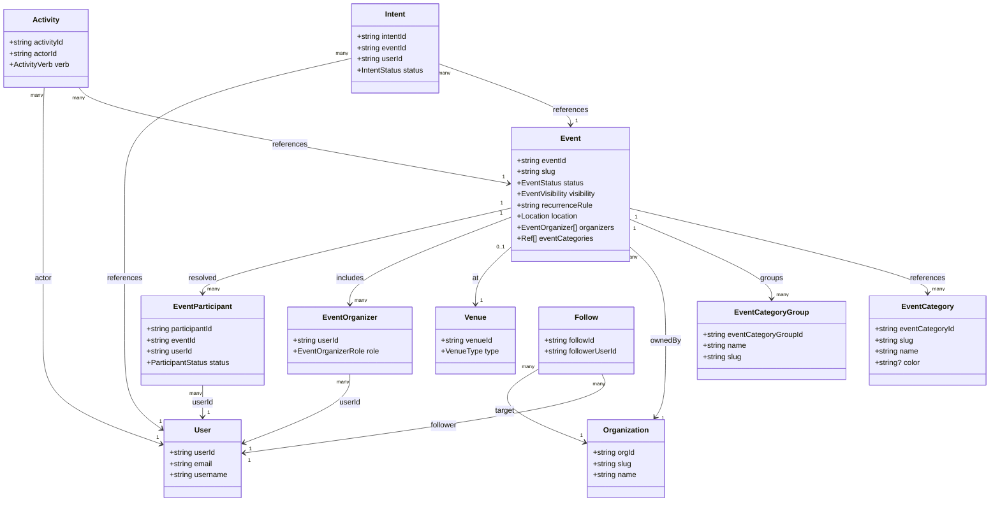

# Domain Data Model

This document captures the current data model for Gatherle’s event platform as implemented in the backend, plus the
near-term gaps we expect to fill. All types referenced here map to TypeGraphQL/Typegoose classes in
`packages/commons/lib/types` and are persisted via Mongoose models in `apps/api/lib/mongodb/models`.

## Core Goals

- Support individuals and organizations hosting repeatable and one-off experiences.
- Keep participation (RSVPs) auditable over time.
- Allow growth into paid events, invites, waitlists, and richer engagement.
- Enable a social layer that creates FOMO: users see where friends and followed orgs are going, with privacy-aware
  visibility.

## Implementation Status

**Implemented today**

- User, Event, EventCategory, EventCategoryGroup
- EventParticipant
- Organization, OrganizationMembership, Venue
- Follow, Intent, Activity

**Planned/partial**

- Invitation, WaitlistEntry
- Comment, Reaction, Audit Trail

## Entities (Current Implementation)

### Visual overview

The following Mermaid class diagram summarizes the primary relationships among the persisted entities (the Excalidraw
file has a richer layout if you prefer a canvas view).



### User

The `User` model represents every person that authenticates with the platform—it drives access control, identity, and
personalized behavior (feeds, RSVPs, follows) so other collections can tie metadata back to a real person.

- `userId`, `email`, `username`, `userRole`.
- Profile fields: `given_name`, `family_name`, `birthdate`, `gender`, `phone_number`, `profile_picture`, `bio`.
- `location { city, state, country, coordinates { latitude, longitude } }` for personalized event recommendations, plus
  `interests` (EventCategory refs).
- Social & visibility: `primaryTimezone`, `defaultVisibility`, `socialVisibility`, `shareRSVPByDefault`,
  `shareCheckinsByDefault`, `mutedUserIds`, `blockedUserIds`.
- Structured profile: `profile { displayName, bio, avatar, socialLinks[] }`.
- Preferences: `preferences { communicationPrefs, notificationPrefs }`.

### Organization

Organizations capture a workspace context for events—defaults for visibility/billing, ownership, and followable state—so
individuals can operate together without mixing personas.

- `orgId`, `slug`, `name`, `description`, `logo`, `ownerId`.
- `defaultVisibility`, `billingEmail`, `links[]`, `domainsAllowed[]`.
- `eventDefaults { visibility, remindersEnabled, waitlistEnabled, allowGuestPlusOnes }`.
- Social: `followersCount`, `isFollowable`, `tags[]`.
- Memberships are stored in `OrganizationMembership` (see below) and resolved in GraphQL.

### OrganizationMembership

Tracks which users belong to which organizations plus their role, so permission checks know who can create/publish
events or manage billing for that org.

- `membershipId`, `orgId`, `userId`, `role` (Owner|Admin|Host|Moderator|Member), `joinedAt`.
- Enforces uniqueness per `(orgId, userId)`.

### Venue

Stores reusable meeting spaces for events, including geolocation/address data so the UI and notifications can render
consistent location details regardless of who creates the event.

- `venueId`, optional `orgId`, `type` (Physical|Virtual|Hybrid), `name`.
- `address { street, city, region, country, postalCode }`.
- `geo { latitude, longitude }`.
- `url`, `capacity`, `amenities[]`.

### EventCategory

Lightweight taxonomy entries that label events and users for filtering, preferences, and follow features; stored once
and referenced via `eventCategories` and `interests`.

- `eventCategoryId`, `slug`, `name`, `iconName`, `description`, optional `color`.

### EventCategoryGroup

Groups of categories for UI/curation purposes (e.g., “Music” or “Community”) so we can surface healthy category
hierarchies without hardcoding them into business logic.

- `eventCategoryGroupId`, `name`, `slug`, `eventCategories[]`.

### Location (embedded in Event)

Embeds the spatial context of an event without separating it into its own collection, so each Event owns a snapshot of
where it will happen (useful for recurrence, history, and location changes).

- `locationType`: `venue` | `online` | `tba`.
- `coordinates { latitude, longitude }`.
- `address { street, city, state, postalCode, country }`.
- `details` (string) for arbitrary location notes.

### Event

The `Event` document is the heart of the platform—taking organizer intent, location, schedules, and metadata and storing
it as a single source of truth for listing feeds and resolver pipelines.

- Identity: `eventId`, `slug`, `orgId?`.
- Content: `title`, `summary`, `description`, `heroImage`, `media`.
- Status: `status` (Cancelled|Completed|Ongoing|Upcoming).
- Lifecycle: `lifecycleStatus` (Draft|Published|Cancelled|Completed).
- Visibility: `visibility` (Public|Private|Unlisted|Invitation), `privacySetting` (Public|Private|Invitation).
- Schedule: `recurrenceRule` (required), plus `primarySchedule? { startAt, endAt, timezone, recurrenceRule }` and
  `occurrences?[]`.
- Location: `location` (Location type above), `venueId?` and `locationSnapshot?`.
- People: `organizers [{ user: Ref<User>, role: Host|CoHost|Volunteer }]`.
- Taxonomy: `eventCategories[]` (EventCategory refs) for flattened ids.
- Settings: `capacity`, `rsvpLimit`, `waitlistEnabled`, `allowGuestPlusOnes`, `remindersEnabled`, `showAttendees`.
- Metadata:
  - `tags` (JSON): free-form tagging for search and discovery. Typically an array of strings or lightweight tag objects,
    for example:
    - `["family-friendly", "outdoors", "live-music"]`
    - `[{ "key": "audience", "value": "families" }, { "key": "vibe", "value": "chill" }]`
  - `additionalDetails` (JSON): arbitrary, event-specific key–value metadata not modeled as first-class fields. Expected
    to be a shallow object whose values are JSON-serializable, for example:
    - `{ "dressCode": "casual", "parkingInfo": "street + garage", "language": "en" }`
    - `{ "sponsor": { "name": "Acme Corp", "tier": "gold" } }`
  - `comments` (JSON): reserved for inline or system-generated comments associated with the event. May be unused in some
    deployments. When used, it is typically an array of comment objects that reference users rather than storing full
    user data, for example:
    - `[{"userId": "u123", "text": "Doors open at 7pm", "createdAt": "2024-01-01T18:00:00Z"}]`
  - `eventLink`: canonical URL for the event’s public landing page (may point to an internal or external site).
- `participants` is resolved by GraphQL via `EventParticipant` and is not stored on the Event document.

### EventParticipant

Event participants are stored separately so RSVP/attendance history can be audited, shared visibility honored, and
quantities tracked without mutating the Event document frequently.

- `participantId`, `eventId`, `userId`, `status` (Interested|Going|Waitlisted|Cancelled|CheckedIn).
- `quantity`, `invitedBy`, `sharedVisibility` (Public|Followers|Private).
- `rsvpAt`, `cancelledAt`, `checkedInAt`.

### Follow

Follow entries model the social graph edges, letting the feed/caching layer enforce muted or asynchronous follow
relationships without denormalizing user objects.

- `followId`, `followerUserId`, `targetType` (User|Organization), `targetId`.
- `status` (Active|Muted), `createdAt`.

### Intent

Intents are lightweight signals (Interested, Going, etc.) that are cheaper to write/read than EventParticipant rows and
feed the UI before RSVPs are confirmed.

- `intentId`, `userId`, `eventId`, optional `participantId`.
- `status` (Interested|Going|Maybe|Declined).
- `visibility` (Public|Followers|Private), `source` (Manual|Invite|OrgAnnouncement).
- `metadata` (JSON), `createdAt`, `updatedAt`.

### Activity

Activities capture actions taken by actors (users/orgs) so the feed knows what happened, when, and how visible the story
should be.

- `activityId`, `actorId`, `verb` (Followed|RSVPd|Commented|Published|CreatedOrg|CheckedIn|Invited).
- `objectType` (User|Organization|Event|Comment), `objectId`.
- `targetType?`, `targetId?`, `visibility` (Public|Followers|Private), `eventAt`, `metadata`.

## Planned Entities & Extensions

### Invitation / WaitlistEntry (planned)

- Invitations: `inviteId`, `eventId`, `email|userId`, `status`, `sentAt`, `respondedAt`, `role?`.
- Waitlist: `waitlistEntryId`, `eventId`, `userId`, `priority`, `createdAt`.

### Comment / Reaction / AuditTrail (planned)

- Dedicated collections to replace the current `Event.comments` JSON payloads.
- Audit entries for tracking field-level changes on Event.

## Privacy & Visibility Rules

- User defaults: `socialVisibility`, `shareRSVPByDefault`, `shareCheckinsByDefault`.
- EventParticipant `sharedVisibility` determines attendee visibility in feeds and event pages.
- Follow status `Muted` suppresses feed items while keeping the edge.
- Event `showAttendees` hides attendee lists from non-organizers; counts can still be exposed.

## GraphQL Query Patterns

- List queries accept `QueryOptionsInput` (`pagination`, `sort`, `filters`) and are translated into Mongo aggregation
  pipelines.
- Ownership checks for sensitive mutations live in `apps/api/lib/utils/auth.ts` and rely on `OPERATION_NAMES` for
  enforcement.

## Field Resolution Strategy (Hybrid Approach)

The API uses a **hybrid approach** combining MongoDB aggregation pipelines with GraphQL field resolvers to balance
performance and flexibility.

### The Problem: N+1 Queries

Without optimization, fetching 20 events with their participants would execute:

- 1 query for events
- 20 queries for participants (one per event)
- 20+ queries for user data on each participant

### The Solution: Aggregation + Field Resolver Fallback

#### 1. Aggregation Pipeline (for Read Queries)

Read operations (`readEvents`, `readEventById`, `readEventBySlug`) use MongoDB `$lookup` to join related data in a
single database round-trip:

```typescript
// apps/api/lib/utils/queries/aggregate/lookup.ts
export const createEventLookupStages = (): PipelineStage[] => [
  // Join eventCategories
  { $lookup: { from: 'eventcategories', localField: 'eventCategories', ... } },

  // Join organizers.user
  { $lookup: { from: 'users', let: {organizerUserIds: '$organizers.user'}, ... } },

  // Join participants from EventParticipant collection
  { $lookup: { from: 'eventparticipants', localField: 'eventId', foreignField: 'eventId', as: 'participants' } },

  // Enrich participants with user data
  { $lookup: { from: 'users', let: {participantUserIds: '$participants.userId'}, ... } },
];
```

#### 2. Field Resolvers (Fallback for Mutations)

Mutations (`createEvent`, `updateEvent`, `deleteEvent`) return raw documents without `$lookup`. Field resolvers detect
this and fetch data on-demand using DataLoaders:

```typescript
// apps/api/lib/graphql/resolvers/event.ts
@FieldResolver(() => [EventParticipant], {nullable: true})
async participants(@Root() event: Event, @Ctx() context: ServerContext) {
  // Fast path: already populated from aggregation
  if (event.participants?.[0]?.participantId) {
    return event.participants;
  }

  // Fallback: fetch and enrich via DataLoader
  const participants = await EventParticipantDAO.readByEvent(event.eventId);
  return Promise.all(participants.map(async (p) => ({
    ...p,
    user: await context.loaders.user.load(p.userId),
  })));
}
```

#### 3. DataLoaders (Batching for Field Resolvers)

When field resolvers need to fetch related data, DataLoaders batch multiple requests into single queries:

```typescript
// If 20 participants need user data, DataLoader batches into 1 query:
// SELECT * FROM users WHERE userId IN ('u1', 'u2', ..., 'u20')
const user = await context.loaders.user.load(participant.userId);
```

### Resolution Flow by Operation Type

| Operation         | Uses $lookup? | Field Resolver Behavior      |
| ----------------- | ------------- | ---------------------------- |
| `readEvents`      | ✅ Yes        | Returns pre-populated data   |
| `readEventById`   | ✅ Yes        | Returns pre-populated data   |
| `readEventBySlug` | ✅ Yes        | Returns pre-populated data   |
| `createEvent`     | ❌ No         | Fetches via DAO + DataLoader |
| `updateEvent`     | ❌ No         | Fetches via DAO + DataLoader |
| `deleteEvent`     | ❌ No         | Fetches via DAO + DataLoader |

### Key Files

- **Lookup stages:** `apps/api/lib/utils/queries/aggregate/lookup.ts`
- **Pipeline builder:** `apps/api/lib/utils/queries/aggregate/eventsPipeline.ts`
- **Field resolvers:** `apps/api/lib/graphql/resolvers/event.ts`
- **DataLoaders:** `apps/api/lib/graphql/context/loaders.ts`

### Why This Pattern?

1. **Performance:** Aggregation minimizes DB round-trips for common read paths
2. **Flexibility:** Field resolvers handle edge cases (mutations, partial data)
3. **Consistency:** Same field always returns the same shape regardless of source
4. **Maintainability:** Business logic stays in one place (field resolver)

## Feed & FOMO Flow

1. User follows User/Organization → `Follow` created, `Activity: Followed`.
2. User marks Going/Interested → `Intent` created/updated; `EventParticipant` is upserted.
3. Feed query pulls Activities where:
   - actor is in my follow set, and
   - activity visibility allows (Public or Followers when I follow), and
   - I’m not blocking/muting the actor/org.
4. Event detail can show “Friends going” via intersecting my follow set with visible Intents/Participants.

## Mongo/NoSQL Adaptation Strategy (current)

- **Reference + resolve:** Most relationships are stored as IDs and resolved in GraphQL (e.g., Event → EventParticipant,
  Organization → OrganizationMembership).
- **Use JSON for flexible fields:** `tags`, `additionalDetails`, `comments`, and several metadata blobs are stored as
  JSON to move fast.
- **Indexes (implemented):**
  - Event: `eventId`, `slug` are unique; `eventCategories` and `organizers.user` are populated for reads.
  - EventParticipant: unique `{eventId, userId}`.
  - Organization: unique `slug`.
  - OrganizationMembership: unique `{orgId, userId}`.
  - Follow: unique `{followerUserId, targetType, targetId}`.
  - Intent: unique `{userId, eventId}`.
  - Activity: index `{actorId, eventAt}`.

## Suggested Next Steps

- Replace `Event.comments` JSON with `Comment` and `Reaction` collections and wire up resolvers.
- Introduce `Invitation`, and `WaitlistEntry` types + DAOs + resolvers.
- Add projections/denormed summary fields for high-traffic reads (event title/org info on Activity).
- Capture `locationSnapshot` consistently for published events to preserve historical data.
