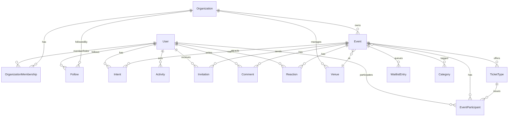

# Domain Data Model

This document captures the current target model for Ntlango’s event platform, emphasizing extensibility and clear ownership boundaries.

## Core Goals
- Support individuals and organizations hosting repeatable and one-off experiences.
- Keep participation (RSVP/tickets) auditable over time.
- Allow growth into paid tickets, invites, waitlists, and richer engagement.
- Enable a social layer that creates FOMO: users see where friends and followed orgs are going, with privacy-aware visibility.

## Entities

### User
- `userId`, `username`, `email`, `roles` (Admin|Host|User), `primaryTimezone`, `defaultVisibility`.
- Profile: `displayName`, `bio`, `avatar`, `socialLinks`.
- Preferences: `communicationPrefs` (channels + topics), `notificationPrefs`.
- Social settings: `socialVisibility` (Public|Followers|Private), `shareRSVPByDefault`, `shareCheckinsByDefault`, `mutedUserIds`, `blockedUserIds`.

### Organization
- Purpose: groups hosts, venues, and events under shared ownership/policy.
- Fields: `orgId`, `slug`, `name`, `description`, `logo`, `ownerId`, `memberRoles: [{ userId, role }]` (Owner|Admin|Host|Moderator|Member), `defaultVisibility`, `billingEmail?`, `links?`, `createdAt`.
- Policies: `eventDefaults` (visibility, reminders, ticket settings), `allowedTicketAccess` (Public|Members|InviteOnly), `domainsAllowed?`.
- Relationships: owns events, venues, invitation policies; members can host depending on role.
- Social: `followersCount`, `isFollowable` (toggle if some orgs don’t want followers), `tags` for discovery.

### Venue
- Fields: `venueId`, `orgId?`, `type` (Physical|Virtual|Hybrid), `name`, `address` (street/city/region/country/postal), `geo` (lat/lng), `url?` (virtual), `capacity?`, `amenities?: string[]`.
- Snapshots: `locationSnapshot` lives on Event to preserve historical address even if venue updates.

### Category and Tag
- `categoryId`, `name`, `slug`, `iconName`, `color`, `description`.
- CategoryGroup (navigation aid): e.g., “Arts & Culture” containing curated categories like “Music”, “Theatre”. Use for navigation and theming, not user-generated.
- Tags: freeform `tagList: string[]` on Event for flexible, user-driven descriptors (e.g., “jazz”, “rooftop”, “founder circle”). Not curated; used for search and recommendations, not primary navigation.

### Event
- Identity: `eventId`, `slug`, `orgId?`.
- Content: `title`, `summary`, `description`, `heroImage`, `media: MediaAsset[]`, `attachments`.
- Status/visibility: `status` (Draft|Published|Cancelled|Completed), `visibility` (Public|Private|Unlisted|Invitation).
- Schedule: `primarySchedule { startAt, endAt, timezone, recurrenceRule? }`, optional `occurrences[]` for generated instances.
- Location: `venueId?`, `locationSnapshot` (address/url at publish time).
- People: `organizers: [{ userId, role: Host|CoHost|Volunteer }]`.
- Taxonomy: `categoryIds: string[]`, `tagList: string[]`.
- Settings: `rsvpLimit?`, `allowGuestPlusOnes`, `waitlistEnabled`, `remindersEnabled`.
- Monetization: `ticketTypes[]`, `currency`, `refundPolicy?`.
- Privacy: `privacySetting` (aligns with visibility) and optional invite-only flag.
- Social signals: exposure driven by `Intent` (below) and `Activity` entries; event can choose `showAttendees` (bool) to limit public attendee lists.

### TicketType
- `ticketTypeId`, `eventId`, `name`, `description`, `price`, `currency`, `capacity`, `salesWindow { startAt, endAt }`, `access` (Public|Members|InviteOnly), `perUserLimit?`, `refundableUntil?`, `addons?`.

### EventParticipant
- `participantId`, `eventId`, `userId`, `ticketTypeId?`, `status` (Interested|Going|Waitlisted|Cancelled|CheckedIn), `quantity`, `invitedBy?`, `rsvpAt`, `cancelledAt?`, `checkedInAt?`, `notes?`.
- Add `sharedVisibility` (Public|Followers|Private) to reflect what can be surfaced in feeds; default inherits from user settings.

### WaitlistEntry
- `waitlistEntryId`, `eventId`, `userId`, `priority`, `createdAt`.

### Invitation
- `inviteId`, `eventId`, `email|userId`, `status` (Sent|Accepted|Declined|Expired), `sentAt`, `respondedAt?`, `role?` (for co-host invites).
- Track `sourceFollow?` for invites sent because a friend/org is going.

### MediaAsset
- `mediaId`, `type` (Image|Video|Doc), `url`, `alt`, `width?`, `height?`, `order`.

### Comment / Reaction
- `commentId`, `eventId`, `userId`, `body`, `parentId?`, `createdAt`.
- `reactionId`, `targetType` (Event|Comment), `targetId`, `userId`, `kind` (Like|Celebrate|Interested), `createdAt`.

### Audit Trail
- `eventAuditId`, `eventId`, `changes: [{ field, oldValue, newValue, changedBy, changedAt }]`.

### Social Graph & FOMO (New)
- **Follow**: `followId`, `followerUserId`, `targetType` (User|Organization), `targetId`, `status` (Active|Muted), `createdAt`.
  - Muting allows keeping the edge but suppressing feed items.
- **Intent**: signals “where people are going”
  - Fields: `intentId`, `userId`, `eventId`, `status` (Interested|Going|Maybe|Declined), `visibility` (Public|Followers|Private), `createdAt`, `source` (Manual|Ticket|Invite|OrgAnnouncement).
  - Typically derived/kept in sync with `EventParticipant` (Going/Cancelled/Waitlisted); `Interested/Maybe` can be lighter weight without tickets.
- **Activity**: feed item for personalization
  - Fields: `activityId`, `actorId`, `verb` (Followed|RSVPd|Commented|Published|CreatedOrg|CheckedIn|Invited), `objectType` (User|Organization|Event|Comment|TicketType), `objectId`, `targetType?`, `targetId?`, `eventAt`, `visibility` (Public|Followers|Private), `metadata?`.
  - Populated on key actions to fan-out feeds; respects visibility on read.
- **OrganizationMembership**: `orgId`, `userId`, `role` (Owner|Admin|Host|Moderator|Member), `joinedAt`.
  - Drives permissions for event creation, venue management, and org-level announcements.

### Privacy & Visibility Rules
- User defaults: `socialVisibility`, `shareRSVPByDefault`, `shareCheckinsByDefault`.
- Intent visibility: set per intent; defaults from user. Drives whether an activity can show up in follower feeds.
- Event-level toggle `showAttendees`: if false, hide attendee lists except for organizers/admins; still allow counts.
- Follow status `Muted` suppresses feed but keeps the edge (useful for soft-unfollow).

## Key Relationships (Mermaid)

## Feed & FOMO Flow
1) User follows User/Organization → `Follow` created, `Activity: Followed`.
2) User marks Going/Interested → `Intent` created/updated, `Activity: RSVPd` created with visibility; participant record updated if ticketed.
3) Feed query pulls Activities where:
   - actor in my follow set, and
   - activity visibility allows (Public or Followers when I follow), and
   - I’m not blocking/muting the actor/org.
4) Event detail can show “Friends going” via intersecting my follow set with public/follower-visible Intents/Participants.

## Notes on Extensibility
- Moving RSVP data into `EventParticipant` decouples attendance history from the Event document and enables tickets, check-ins, and cancellations.
- `Follow` + `Intent` + `Activity` give a flexible feed surface without overloading Event documents.
- `Organization` provides policy scoping (default visibility, ticket access rules) and a clear permission surface for multi-host teams; also followable for org announcements.
- `Venue` and `locationSnapshot` give us safe historical data while allowing updates to shared venues.
- `TicketType` with `access` and `salesWindow` supports future promo codes and membership-only sales.
- `Invitation` and `WaitlistEntry` set us up for structured invite flows and auto-promotions from waitlists.

## Next Steps
- Define TypeGraphQL/Typegoose classes matching these shapes in `packages/commons/lib/types` (Follow, Intent, Activity, OrganizationMembership, etc.).
- Add migration scripts to backfill `orgId` and move RSVP data into `EventParticipant`, and to seed Intent records for existing participants.
- Extend resolvers/DAOs for Organizations, Venues, TicketTypes, Participants, Waitlist, Follows, Intents, and feed queries with visibility enforcement.

## Migration Phasing (recommended)
Before new collections, apply new attributes to existing types:
- User: `primaryTimezone`, `defaultVisibility`, `profile { displayName, bio, avatar, socialLinks }`, `preferences { communicationPrefs, notificationPrefs }`, social settings (`socialVisibility`, `shareRSVPByDefault`, `mutedUserIds`, `blockedUserIds`), support multiple roles.
- Event: `orgId`, `summary`, `heroImage`, `media: MediaAsset[]`, `visibility` (Public|Private|Unlisted|Invitation), `status` (Draft|Published|Cancelled|Completed), `primarySchedule` (+ `recurrenceRule`, `occurrences`), `venueId` + `locationSnapshot`, `organizers` with roles, `categoryIds` + `tagList`, settings (`rsvpLimit`, `waitlistEnabled`, `allowGuestPlusOnes`, `remindersEnabled`, `showAttendees`).

Phase plan:

| Phase | Scope | Effort |
| --- | --- | --- |
| 1. Participation | Extract `rsvpList` → `EventParticipant` collection; add basic status tracking | Medium |
| 2. Organizations | Add `Organization`, `OrganizationMembership`, `Venue`; link events via `orgId` | Medium-High |
| 3. Ticketing | Add `TicketType`, `WaitlistEntry`, `Invitation`; extend `EventParticipant` with `ticketTypeId` | Medium |
| 4. Social Layer | Add `Follow`, `Intent`, `Activity`; extend `User` with social settings; wire feed/visibility | High |
| 5. Rich Media & Engagement | Add `MediaAsset`, `Comment`, `Reaction`, `Audit Trail` | Medium |

## Mongo/NoSQL Adaptation Strategy
- **Embed stable snapshots**: keep small, relatively immutable data on parents to avoid frequent lookups (e.g., `locationSnapshot`, `organizers` roles on Event, `media` array, org name/logo on Event, actor displayName/avatar on Activity).
- **Reference high-churn/fan-out**: keep separate collections for `EventParticipant`, `Intent`, `Follow`, `Activity`, `TicketType`, `WaitlistEntry` with indexes; denormalize key fields (event title/hero, org name, actor info) for read speed.
- **Categories/Tags**: curated Categories/CategoryGroup collections; Events store `categoryIds` and `tagList`. Index on `categoryIds`, `tagList`, `orgId`.
- **Organizations/Venues**: reference via `orgId`/`venueId` and store snapshots on Event to preserve history; keep full docs in their own collections.
- **Feed/Activity**: append-only Activity collection with visibility flags and denormed actor/object/org snippets. Index on `actorId`, `targetType/targetId`, `eventAt`, `visibility`. Start with query-time filtering; optionally materialize per-user timelines if volume grows.
- **Intent vs Participant**: keep both; allow `participantId` on Intent for ticketed flows. “Interested/Maybe” intents can exist without participants.
- **Follow graph**: single Follow collection (`followerUserId`, `targetType`, `targetId`, `status`). Index on follower for fan-out and on target for counts.
- **Counters**: maintain counts on Event/Org (followers, intents, participants) with atomic inc/dec and periodic reconciliation jobs to avoid heavy aggregations on hot paths.
- **Indexes (indicative)**:
  - Event: `{ orgId, status, visibility, primarySchedule.startAt }`, `{ categoryIds: 1 }`, `{ tagList: 1 }`
  - Participant: `{ eventId, status }`, `{ userId, status }`
  - Intent: `{ userId }`, `{ eventId, status }`
  - Activity: `{ actorId }`, `{ targetType, targetId }`, `{ visibility, eventAt }`
  - Follow: `{ followerUserId }`, `{ targetId, targetType }`
- **Aggregation guidance**: prefer denorm + targeted projections over deep `$lookup`. For attendee lists, query `EventParticipant` by `eventId` with limits; use counts on Event for quick stats.

